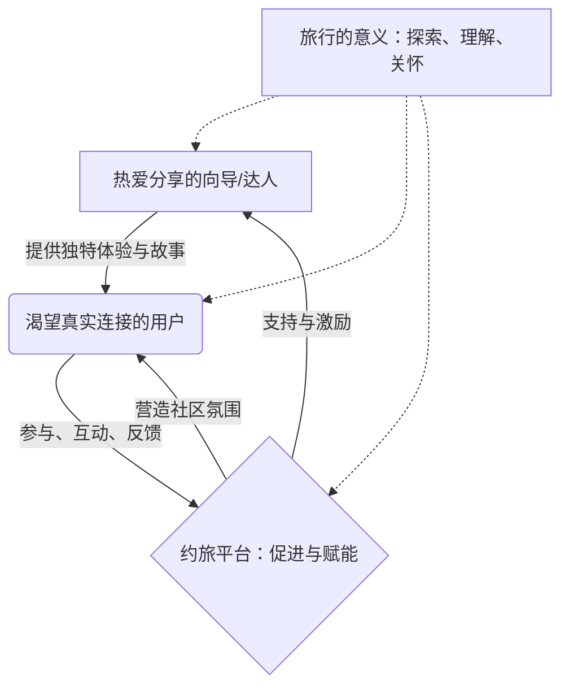

# 约旅平台PPT内容提纲 (供AI生成PPT使用)

## 文档说明
- 本文档根据 `ppt.md` 的内容整理而成，旨在为AI提供清晰的指令以生成PPT页面。
- 每一部分对应原始PPT的一张幻灯片。
- 请AI根据每一部分的“幻灯片内容”、“视觉设计建议”和“演讲脚本”来生成对应的PPT页面。

---

## 第1张：开场标题页

### 幻灯片内容
**主标题**: 约旅平台
**副标题**: 连接你我，重拾旅行的温度
**Slogan**: 社交旅行 × 人文关怀 × 真实体验 = 生活新篇章

### 视觉设计建议
- **背景**: 香港维港夜景全景图 (温馨、有连接感，而非纯科技感)
- **前景**: 可考虑柔和的半透明图层，避免过于硬朗的科技感。
- **Logo**: 约旅平台品牌标识 (清晰、友好)
- **底部**: 演讲者信息和日期 (简洁明了)
- **整体风格**: 温馨、人文、略带现代感，突出“连接”和“温度”。

### 演讲脚本 (AI可参考，用于理解内容侧重)
"各位尊敬的来宾，大家好！

在这个快节奏的时代，科技日新月异，我们的生活似乎越来越便捷，但人与人之间的距离，似乎也越来越远。我们有多久没有和朋友一起放声歌唱，有多久没有一起探索未知的风景，有多久没有真正地去体验生活，而不是被工作和赚钱所裹挟？

我们是否也曾怀念，小时候那种邻里串门、朋友相聚的纯粹快乐？我们是否也曾渴望，摆脱“金钱的奴隶”这种标签，去追求真正热爱的事情，去感受生活本来的面貌？

今天，我们带来的“约旅平台”，正是希望回应这份内心的呼唤。我们相信，旅行不应只是走马观花，更是一场心灵的约会，一次人与人、人与自然的深度连接。我们希望通过约旅，让喜欢玩的人带着对生活充满好奇的人一起去探索，去分享，去创造属于自己的美好回忆。

我是[姓名]，约旅平台的[职位]。今天，我将用18分钟的时间，与大家分享我们如何通过“约旅平台”，倡导一种全新的社交旅行方式，回归旅行的本质，重拾生活的温度。"

---

## 第2张：问题洞察

### 幻灯片内容
**标题**: 时代的呼唤：我们为何渴望真实的连接与体验？

**内容布局建议 (图文结合，强调对比和渴望)**:
左侧 (现代生活的困境 - 可用简约图标或灰调图片辅助)：
- 科技带来的疏离感
- 生活节奏过快，压力巨大
- 目标迷失，意义感缺失
- 标准化生活，个性被压抑

右侧 (我们内心的渴望 - 可用温暖、明亮的图标或图片辅助)：
- 真实的人际互动
- 放慢脚步，体验生活
- 寻找热爱，分享快乐
- 追求独特，活出自我

**核心思考点 (可作为小字注解或视觉元素融入)**:
- 科技越发达，我们越需要人文关怀。
- 旅行是促进交流、体验生活、找回自我的重要途径。
- 我们不应成为“金钱的奴隶”，而应成为生活的主人。

### 视觉设计建议
- **排版**: 左右对比，或上下对比，清晰展示“困境”与“渴望”。
- **色调**: “困境”部分可使用较冷或较暗色调，“渴望”部分使用温暖、明亮色调。
- **元素**: 使用能引发共鸣的简约图标或图片，避免复杂。
- **整体风格**: 引人深思，具有情感冲击力。

### 演讲脚本 (AI可参考)
"我们生活在一个前所未有的时代。科技的飞速发展，AI的兴起，无疑为我们带来了巨大的便利。但与此同时，我们是否也感受到了一些隐忧？

第一，科技带来的疏离感。我们习惯了在线交流，却可能忘记了面对面沟通的温暖。朋友圈点赞无数，却可能找不到一个可以深夜畅谈的朋友。

第二，快节奏下的生活压力。我们每天忙于工作，追逐KPI，仿佛陷入了一个赚钱的循环，却渐渐忘记了奋斗的初衷是什么，忘记了去好好体验生活，感受世界的美好。

第三，意义感的缺失与个性的压抑。我们常常被社会定义，被期望所束缚，追求着标准化的成功，却可能忽视了内心真正的热爱和渴望。人生只有一次，我们真的要这样被定义吗？

这些困境，让我们更加渴望真实的人际互动，渴望放慢脚步去体验生活，渴望找到自己热爱的事情并与人分享，渴望活出独特的自我。而旅行，正是承载这些渴望的最佳方式之一。它让我们走出日常，遇见不同的人，看不一样的风景，体验多元的文化，最终，更好地认识自己，关怀他人。"

---

## 第3张：我们的答案：约旅平台 - 用心连接每一次旅行

### 幻灯片内容
**标题**: 约旅平台 - 用心连接每一次旅行

**核心价值主张 (三点式，图标+文字)**:
- 💖 **回归社交本质**: 
    - 鼓励真实分享，构建有温度的旅行社区
    - 促进成员互动，结识志同道合的旅伴
- 🌿 **倡导人文关怀**:
    - 尊重个体差异，提供包容性的旅行选择
    - 关注情感需求，让旅行充满温暖与关爱
- ✨ **追求真实体验**:
    - 摆脱滤镜，发现旅途中的本真之美
    - 深入当地，体验原汁原味的风土人情

**平台理念 (醒目突出)**: 让喜欢玩的人，带着对世界好奇的人一起玩，实现共同的热爱与自由。

### 视觉设计建议
- **布局**: 核心价值主张清晰分点展示，可考虑使用圆形、卡片式设计。
- **图标**: 为每个价值主张搭配温馨、表意清晰的图标。
- **色彩**: 延续温暖、人文的色调。
- **图片**: 可选用展现真实互动、温馨关怀、自然美景的图片作为背景或点缀。
- **整体风格**: 积极、温暖、充满希望。

### 演讲脚本 (AI可参考)
"有时候，我们只是想找一个能懂自己的人，一起走走看看。约旅平台其实就是这样一个小小的心愿的延伸。

我们并不想用太多华丽的词语去包装旅行。我们更在意的是，能不能在路上遇见同样渴望真实、渴望分享的人。

每个人的故事都不一样，我们希望这里能包容那些细腻的情感和小小的期待。也许你只是想有人陪你聊聊天，或者一起安静地看风景。

我们不追求完美的滤镜，只想让每一次出发都更贴近生活本身。希望你能在这里，遇见温暖、遇见理解，也遇见更自在的自己。

---

## 第4张：约旅如何促进连接与关怀

### 幻灯片内容
**标题**: 约旅如何促进连接与关怀

**核心体验设计 (四点式，图标+标题+简要说明)**:
1. 🤝 **遇见懂你的人 (个性化匹配)**
   - 基于共同兴趣与价值观的连接
   - 发现志同道合的旅伴与向导
   - 告别孤独，与“对的人”同行

2. 🌍 **身临其境的预体验 (灵感激发)**
   - 通过分享与故事，感受目的地的魅力
   - 激发探索欲，点燃旅行的火花
   - 在出发前，就已心向往之

3. 💬 **分享与共鸣的社区 (情感连接)**
   - 真实的旅行故事与经验分享
   - 建立有温度的互动与情感支持
   - 在这里，每个声音都被听见，每份感受都被理解

4. ❤️ **用心守护每一程 (安全与关怀)**
   - 透明的行程规划与信息共享
   - 互助友爱的社区氛围
   - 必要的安全提醒与支持，让关怀无处不在

### 视觉设计建议
- **布局**: 四个核心体验点可采用并列、环绕或分步展示的方式。
- **图标**: 为每个体验点设计生动、形象的图标。
- **色彩**: 保持整体温暖、友好的风格。
- **图片**: 可选用展现人们互动、分享、安全感的场景图片。
- **整体风格**: 清晰、易懂，突出平台如何用心设计体验。

### 演讲脚本 (AI可参考)
"那么，‘约旅’是如何促进人与人之间的连接与关怀的呢？我们一直在思考，或许那份‘真实’与‘用心’是其中的关键。在‘约旅’，我们没有把目光放在追求海量的用户和冰冷的算法匹配上。我们更在乎的是，能不能为大家创造一个让人感到安全、友好、可以轻松信任的交流氛围。我们特别欣赏那些真正热爱分享、自己本身就有很多故事、能传递温暖的向导和旅行达人，觉得他们不仅仅是行程的组织者，更像是文化的使者和情感的桥梁。我们期待着，通过一些用心的社群互动设计，能让大家在出发前就能对彼此有所了解，建立一点点信任；在旅途中，可以很自然地聊天、互相帮助；旅行结束后，那些美好的回忆能被好好珍藏，情谊也能延续下去。我们总觉得，当人与人之间有了那份真诚的互动和关怀，旅行好像就变得更有味道了，生活似乎也因此多了几分暖意。"

---

## 第5张：约旅平台：为社交与关怀而设计

### 幻灯片内容
**标题**: 约旅平台：为社交与关怀而设计

**核心体验模块 (用户视角 - 可用流程图或卡片式展示)**:
- **探索与发现**:
    - 浏览真实的旅行故事与分享
    - 发现志同道合的旅伴与向导
    - 个性化主题旅行推荐 (如文化探索、自然徒步、美食之旅等)
- **连接与互动**:
    - 便捷的沟通工具，与向导/旅伴深入交流
    - 参与社区话题讨论，分享见解与感悟
    - 组织或加入小团体旅行，共享旅途乐趣
- **规划与启程**:
    - 透明的行程信息与合理的费用结构
    - 灵活的定制化服务，满足个性需求
    - 清晰的安全指引与互助提醒
- **分享与回馈**:
    - 记录并分享你的旅行点滴与感悟
    - 评价与感谢为你提供帮助的向导和旅伴
    - 成为分享者，将你的热爱传递给更多人

**赋能分享者 (向导/旅行达人 - 可用单独板块或并列展示)**:
- **展现你的热爱**:
    - 创建个性化的主页，分享你的旅行理念与专长
    - 发布你精心策划的旅行路线与体验活动
    - 与认同你的人建立连接，共同探索
- **轻松管理与互动**:
    - 便捷的行程管理与沟通工具
    - 获取真实的反馈，持续优化体验
    - 成为社群的积极贡献者，传递正能量

### 视觉设计建议
- **布局**: 用户视角和分享者视角的内容可以分区域展示，或通过动画效果切换。
- **图标/图形**: 使用简约图标辅助说明各个模块功能。
- **流程感**: 用户视角的模块可以体现出用户旅程的递进关系。
- **色彩**: 保持品牌一致性，突出友好和易用性。
- **整体风格**: 功能清晰，体验流畅，体现平台的人性化设计。

### 演讲脚本 (AI可参考)
"为了实现我们所倡导的社交旅行与人文关怀，约旅平台在功能设计上处处体现着用心。

从用户的视角来看：

在“探索与发现”阶段，你看到的不再是冰冷的商品列表，而是由真实用户和热情向导分享的旅行故事与体验。你可以根据共同的兴趣爱好，发现那些真正懂你的旅伴和向导，平台也会为你推荐符合你价值观的个性化主题旅行，无论是深度文化探索，还是轻松的自然徒步。

在“连接与互动”环节，我们提供了便捷的沟通工具，让你能与向导或潜在旅伴进行深入的交流。你可以积极参与社区里的话题讨论，分享你的见解，也可以轻松组织或加入一个小团体，共同规划并享受旅途的乐趣。

当进入“规划与启程”阶段，你会看到透明的行程信息和合理的费用构成。我们鼓励灵活的定制化服务来满足你的个性需求，并提供清晰的安全指引和社群内的互助提醒，让你安心出行。

旅行结束后，在“分享与回馈”模块，你可以方便地记录并分享旅途中的点点滴滴和感悟，向为你提供帮助的向导和旅伴表达感谢。更重要的是，你也可以从一个体验者转变为分享者，将你的热爱和发现传递给更多人。

对于那些乐于分享、热爱带领他人探索的向导或旅行达人们：
约旅平台也为你们提供了充分展现自我的空间。你可以创建个性化的主页，分享你的旅行理念和独特专长，发布你精心策划的旅行路线和体验活动，与那些真正认同你、被你吸引的人建立连接，共同去探索这个精彩的世界。

同时，我们也提供了便捷的行程管理和互动工具，帮助你更好地组织活动，获取真实的反馈，并鼓励你成为社群的积极贡献者，传递旅行中的正能量。我们相信，最好的引导是源于热爱，而非单纯的商业驱动。"

---

## 第6张：我们的价值：连接、分享与成长

### 幻灯片内容
**标题**: 我们的价值：连接、分享与成长

**核心价值循环图 (使用 Mermaid 或类似图形清晰展示)**:

**我们如何创造价值 (要点列出)**:
- 为人与人的连接创造土壤: 打破隔阂，让相似的灵魂在旅途中相遇。
- 为深度的文化交流搭建桥梁: 不止于观光，更在于体验、理解和尊重。
- 为个人成长提供契机: 旅行是最好的学习，每一次出发都是一次自我发现。
- 为热爱与分享提供平台: 让那些对生活充满热情的人，能将这份能量传递给更多人。

### 视觉设计建议
- **核心图表**: 价值循环图应清晰、美观，易于理解各方关系。
- **文字排版**: “我们如何创造价值”的要点应简洁有力。
- **色彩**: 延续品牌色，突出价值感和生态感。
- **图片**: 可选用象征连接、成长、分享的抽象或具象图片。
- **整体风格**: 专业且富有温度，展现平台的价值主张。

### 演讲脚本 (AI可参考)
"谈到商业模式，我们更愿意称之为‘价值创造模式’。约旅平台的核心并非冰冷的交易，而是围绕‘人’本身，去构建一个可持续的、充满人文关怀的生态。

大家可以看到这个循环：
热爱分享的向导和旅行达人们，他们是故事的创造者和独特体验的提供者。他们将自己的热爱、知识和对生活的美好向往，通过约旅平台传递给那些渴望真实连接、期待深度体验的用户。

用户在平台上参与互动，提供真实的反馈，他们的需求和期待又会进一步激励向导们创造更优质的内容和体验。而约旅平台在其中扮演的角色，是促进者和赋能者。我们努力营造一个安全、友好、充满信任的社区氛围，为双方提供必要的支持和激励。

这一切都源于我们对‘旅行的意义’的理解：旅行不仅仅是从一个地方到另一个地方，它关乎探索未知，理解多元文化，更重要的是，在旅途中感受人与人之间的关怀与连接。这才是我们平台价值的核心所在。

我们相信，当平台能够真正为人与人的连接创造土壤，为深度的文化交流搭建桥梁，为个体的成长提供契机，并让那些对生活充满热情的人能够自由地分享时，商业上的成功会自然而来。我们追求的，是能带来长远社会价值的健康成长，而非短期的利益最大化。"

---

## 第7张：时代的需求：回归真实社交与深度体验

### 幻灯片内容
**标题**: 时代的需求：回归真实社交与深度体验

**当代人的渴望 (要点列出，可配小图标)**:
- 厌倦了快节奏与表面化: 在信息爆炸的时代，人们渴望从虚拟回归现实，寻求更真切的情感连接。
- 追求个性化与意义感: 标准化的产品已无法满足需求，人们希望旅行能带来独特的个人体验和生命感悟。
- 对“附近”的重新发现: 不必远方，身边的美好同样值得探索，与志同道合的人一起，发现日常中的诗意。
- 对人文关怀的向往: 在日益原子化的社会，人们期待在社群中找到归属感、温暖和互助。

**约旅的回应 (与渴望对应，要点列出，可配小图标)**:
- 倡导“慢旅行”: 放慢脚步，用心感受，与当地人深入交流，体验真实的生活。
- 聚焦“人的故事”: 每一段旅程，每一个向导，背后都有独特的故事，等待被聆听和分享。
- 构建“有温度的社区”: 在这里，分享不仅仅是信息，更是情感的流动和善意的传递。
- 赋能“热爱生活的人”: 让那些对世界充满好奇、乐于分享的人，成为连接的纽带。

### 视觉设计建议
- **布局**: “渴望”与“回应”可以左右对比或上下呼应展示。
- **图标**: 为每个要点搭配简洁、表意的图标。
- **色彩**: 保持温暖、积极的色调。
- **图片**: 可选用展现真实社交场景、深度文化体验的图片。
- **整体风格**: 紧扣时代脉搏，展现平台的社会价值和前瞻性。

### 演讲脚本 (AI可参考)
"不知道你是否也和我们一样，常常会想，我们是不是错过了些什么？

每天被各种信息包围，手机从不离手，生活节奏快得让人喘不过气。有时候，真的会觉得有点累，会特别怀念小时候那种简单的快乐——邻居家串个门，几个朋友围在一起说说笑笑，无忧无虑。

我们发现，越来越多的人开始厌倦了那种“上车睡觉，下车拍照”的标准化旅行。我们不再只满足于打卡景点，我们更渴望在旅途中找到一些能触动内心的东西，一些能让我们停下来思考和感受的瞬间。

其实，美好的风景不一定只在远方。我们身边的城市，那些熟悉又陌生的角落，可能就藏着许多不期而遇的惊喜。关键是，我们有没有遇到那个对的人，和我们一起去发现，去体验那些不一样的故事。

我们渴望被理解，渴望温暖的连接，渴望在一个小小的社群里找到归属感。尤其是在这个越来越独立的时代，这种渴望似乎更加强烈。

‘约旅’的诞生，其实就是源于这些小小的感受和共同的期盼。我们希望创造一个地方，让大家可以放慢脚步，去真正感受一个地方的温度，听听当地人的故事，体验他们真实的生活。我们相信，每一段旅程，每一个遇见的人，都有它独特的意义。我们想做的，就是把这些热爱生活、乐于分享的朋友们聚在一起，让旅行多一份真诚的陪伴和温暖的记忆。"

---

## 第8张：诚邀您成为我们的“人文旅行合伙人”

### 幻灯片内容
**标题**: 诚邀您成为我们的“人文旅行合伙人”

**我们寻找这样的您 (要点列出，可配图标)**:
- 认同约旅的理念: 您深刻理解并认同我们关于社交旅行和人文关怀的价值主张。
- 热爱分享与连接: 您乐于分享旅行的美好，并善于将人们连接在一起。
- 在当地拥有影响力或资源: 您在特定区域或社群中，能够帮助我们传播理念，组织有意义的活动。
- 期待共同成长: 您希望与一个有情怀、有愿景的平台共同成长，而不仅仅是追求短期商业利益。

**我们能为您提供 (要点列出，可配图标)**:
- 品牌与理念的共享: 成为约旅品牌故事的一部分，共同推广一种更美好的旅行方式。
- 平台资源与工具支持: 利用约旅平台的技术与社群资源，更轻松地组织和推广您的活动。
- 社群共建与价值共享: 参与到约旅大家庭的建设中，共享平台发展带来的成果与喜悦。
- 一个有温度的合作网络: 与来自各地的、志同道合的伙伴们交流学习，共同进步。

**合作方式示例 (简洁列举)**:
- 城市文化沙龙发起人
- 特色主题路线共创者
- 地方社群运营伙伴

### 视觉设计建议
- **布局**: “寻找您”和“提供给您”可以清晰分块展示。
- **图标**: 为关键点搭配合适的图标，增强视觉效果。
- **色彩**: 使用具有亲和力、合作感的色彩。
- **图片**: 可选用展现合作、共建、社群活动的图片。
- **整体风格**: 真诚、开放，传递合作共赢的信号。

### 演讲脚本 (AI可参考)
"朋友们，做约旅这件事，我们越做越觉得，光靠我们自己，力量太单薄了。我们心里有个特别真诚的愿望，就是想邀请懂我们的人，和我们一起，把这份对旅行、对生活的热爱传递开来。我们想找的，是那种眼睛里有光的人。

你是不是也觉得，旅行不只是看看风景，更是感受人与人之间的温暖？你是不是也特别喜欢分享，愿意把那些美好的瞬间、动人的故事讲给更多人听？如果你在当地，刚好有一些特别的资源，或者能聚拢一群志同道合的朋友，那就太棒了！我们最看重的，是那份一起把事情做好的心，那份不只是为了赚钱的情怀。

加入我们，你会得到什么？
你会成为我们故事里的一部分，和我们一起，把这种有温度的旅行方式带给更多人。
我们会把平台的技术、社群都开放给你，让你能更轻松地做自己喜欢的事。
你会和我们一起，看着约旅这个大家庭一点点长大，分享其中的每一份喜悦。
更重要的是，你不会再孤单。你会认识很多很多和你一样有意思的灵魂，大家一起学习，一起成长。

怎么合作？方式不重要，重要的是那份心意。你可以是沙龙的发起人，可以是特色路线的设计师，也可以是我们社群的伙伴。只要你认同我们，愿意和我们一起，为这个世界多创造一点点美好。

这真的不只是一份生意。我们觉得，这是一件特别有意义的事。我们真心期待着，能和你们一起，让旅行回到它最本真的样子，让每个人都能在路上，找到温暖，找到懂自己的人，找到生活更多的可能。谢谢大家！"

---

## 第9张：我们的团队：一群热爱生活与分享的探索者

### 幻灯片内容
**标题**: 因爱集结，为梦前行

**核心理念 (醒目突出)**: 我们相信，旅行的真谛在于分享与连接，技术应服务于人性的温暖。

**团队特质 (可用图形或关键词云展示)**:
- 资深旅行爱好者
- 人文关怀的践行者
- 社群文化的营造者
- 用户体验的极致追求者
- (核心：一群梦想着用科技连接每一个热爱生活灵魂的伙伴)

**团队故事片段 (可选，用1-2张有代表性的团队活动照片或插画替代文字)**:
- (图片/插画1: 展现团队成员在旅行中互助或与当地人交流的温馨场景)
- (图片/插画2: 展现团队成员一起讨论、共创的场景)

### 视觉设计建议
- **核心理念**: 放置在突出位置，字体可稍作设计。
- **团队特质**: 可以用标签云、蜂巢图或者并列的卡片来展示，配以简约图标。
- **图片/插画**: 选择能体现团队活力、协作和人文关怀的照片或风格统一的插画。
- **色彩**: 温暖、积极，体现团队的凝聚力。
- **整体风格**: 真实、有爱，传递团队的价值观。

### 演讲脚本 (AI可参考)
"支撑‘约旅’前行的，是我们这群对生活充满热忱、对世界怀揣好奇、对人与人的连接抱有坚定信念的伙伴。

我们不仅仅是开发者、设计师、运营者，我们首先是旅行的热爱者，是人文关怀的践行者，是社群文化的营造者。我们中的许多人，都有过被旅行中的善意所触动、被人与人的真诚交流所温暖的经历。这些经历，让我们深刻理解现代人对真实社交的渴望，对深度体验的向往。

我们聚在一起，不是为了打造一个冰冷的技术工具，而是希望构建一个充满人情味的社区。我们希望通过‘约旅’，让更多人找到志同道合的旅伴，分享旅途中的喜怒哀乐，共同探索这个精彩的世界，重拾那些在快节奏生活中被忽略的美好与感动。我们相信，科技的力量，最终是为了服务于人性的温暖与连接。"

---

## 第10张：我们的愿景：共创人文社交旅行新篇章

### 幻灯片内容
**标题**: 与时光同行，与美好相约

**发展蓝图 (用更具意境的视觉元素和关键词表达，避免生硬的阶段划分)**:
- **近期 (萌芽与耕耘)**: 
    - 点亮社群星火
    - 打磨有温度的体验
    - 播撒人文种子
- **中期 (成长与繁茂)**:
    - 构建多元文化家园
    - 深化主题旅行
    - 赋能个体分享
- **远期 (连接与远方)**:
    - 成为精神灯塔
    - 推动深度理解与友谊
    - 心灵的回归与滋养

**我们关注 (用关键词突出)**:
- 用户的微笑与满足
- 社群的活跃与温暖
- 平台人文价值的深度与广度
- 每一个被点亮的美好瞬间

### 视觉设计建议
- **发展蓝图**: 可以使用时间轴、成长树、或者递进式的图形来表达，避免过于商业化的箭头和阶段划分。
- **意象图**: 为每个阶段搭配富有诗意和象征意义的背景图。
- **“我们关注”**: 采用醒目的简洁文字，传递平台的核心价值观。
- **色彩**: 充满希望、生机和人文气息。
- **整体风格**: 温馨、浪漫，富有想象空间，传递美好愿景。

### 演讲脚本 (AI可参考)
"对于未来，我们没有冰冷的数字KPI，我们描绘的是一幅充满人文色彩的画卷。

近期，我们将专注于点亮社群的星星之火，汇聚那些真正热爱分享、渴望连接的先行者。我们会用心打磨每一次相遇和互动，让平台充满温度，并鼓励每一个真实、动人的旅行故事在这里生根发芽。

中期，我们希望‘约旅’能成长为一个多元文化交织的旅行者家园。我们将深化各种主题旅行，与大家一同探索生活的无限可能，并赋能每一位用户，让每个人都能成为故事的分享者和创造者。

长远来看，我们梦想‘约旅’能成为全球人文旅行者的精神灯塔，推动跨越地域与文化的深度理解与友谊。我们希望，每一次通过‘约旅’的出发，都能成为一次心灵的回归与滋养。

我们关注的，不是冰冷的数字，而是用户的微笑，社群的温暖，平台人文价值的深度，以及那些因‘约旅’而被点亮的美好瞬间。"

---

## 第11张：与我们同行：投资于人性的温暖与连接

### 幻灯片内容
**标题**: 一份有温度的邀约，共筑人文旅行的未来

**我们相信的价值 (三点式，图标+标题+简要说明)**:
- 💖 **人文关怀的力量**
   - 回归真实连接，用科技传递善意与温暖。
   - 每次连接皆颂扬人文精神。
- ✨ **独特社群的魅力**
   - 汇聚优质用户，共享深度、友善体验。
   - 共创积极社群文化。
- 🌿 **可持续的生命力**
   - 满足社交探索本能，创造社会价值与情感认同。
   - 与用户共成长，构建长久活力生态。

**携手同行 (简洁有力)**:
- 寻理念同行者，不只资金。
- 共投资源智慧热情，共筑人文土壤。
- 共享商业与社会价值，连接人心。

### 视觉建议
- **价值呈现**: 图文点明核心。
- **携手同行**: 文字富情感、号召力。
- **色彩**: 温暖真诚。
- **图片**: 合作/希望/成长。
- **风格**: 人文价值投资。

### 演讲脚本 (AI可参考)
"我们深知，在这个时代谈论情怀与人文，似乎有些不合时宜。但我们坚信，科技越是发达，我们越需要回归人与人之间真实的温暖与连接。这正是‘约旅’的核心价值所在。

我们邀您投资的，不仅仅是一个商业项目，更是一份对人文关怀的信仰，一个独特社群的未来，一种可持续的生活方式。

我们相信人文关怀的力量。在这个快节奏的时代，‘约旅’致力于用科技传递善意，构建一个有温度的社群，让每一次成功的连接都成为对人文精神的颂扬。

我们珍视独特社群的魅力。‘约旅’将汇聚那些真正热爱生活、乐于分享的优质用户。我们强调深度的体验，而非走马观花式的打卡；我们鼓励共同创造与守护一个积极、友善的社区文化。

我们追求可持续的生命力。‘约旅’满足的是人类对社交与探索的本能需求，它所创造的社会价值与情感认同，将超越单纯的商业利益，与用户共同成长，构建一个具有长久活力的生态。

因此，我们寻找的不仅仅是资金，更是认同我们理念、愿意与我们一同浇灌这片人文旅行土壤的同行者。我们期待与您共同投入资源、智慧与热情，未来共享的，也绝不仅仅是商业上的回报，更是那份推动社会向善、连接人心的深深成就感。"

---

## 第12张：我们的初心：重拾温暖连接，丰富生命体验

### 幻灯片内容
**标题**: 旅行的意义，不止于风景

**社会价值与人文关怀 (四点式，图标+标题+简要说明)**:
- 💖 **重燃人际间的温暖**
   - 打破都市隔阂，创造真实的相遇与陪伴
   - 鼓励分享与互助，构建友善互信的旅行氛围
   - 让每一次同行，都成为一段温暖的回忆

- 🌍 **深化文化理解与共情**
   - 走近当地生活，体验多元文化的魅力
   - 促进不同背景人们的对话与交流
   - 用脚步丈量世界，用心灵感受差异与共通

- 🧘 **滋养个体生命成长**
   - 在旅途中发现自我，拓展认知边界
   - 鼓励勇敢尝试，体验生活的不同面向
   - 让旅行成为一种生活态度，一种持续学习与探索的过程

- 😊 **传递快乐与正能量**
   - 分享旅途中的喜悦，点亮他人的生活
   - 倡导积极乐观的生活方式
   - 用美好的体验，对抗生活的疲惫与焦虑

### 视觉设计建议
- **布局**: 四个价值点可以采用环形、矩阵或并列方式展示。
- **图标**: 为每个价值点设计温馨、有代表性的图标。
- **色彩**: 温暖、明亮，充满正能量。
- **图片**: 可选用展现人际温暖、文化交流、个人成长、快乐分享的场景图片。
- **整体风格**: 强调平台的社会责任感和人文情怀，引发情感共鸣。

### 演讲脚本 (AI可参考)
"所以，‘约旅’想做的，不仅仅是一个旅行平台。我们更憧憬着，它能成为一个温暖的连接器，轻轻地将那些热爱生活、渴望分享、期待真实体验的灵魂聚拢在一起。我们珍视这样的价值：能陪伴大家一起，去遇见，去交流，去体验，去感受那些在日常生活中可能不经意间错过的美好。我们深深地感到，真正的旅行，是关乎人与人之间那份不经意的温暖互动，是关乎对不同文化敞开心扉的理解，更是关乎我们每个人生命旅程中悄然的成长与丰盈。我们由衷地希望‘约旅’能像一位老朋友，帮助大家重拾生活的温度，找到那些能聊到一块儿去的伙伴，一起去探索这个大千世界，活出那个内心深处更真实、更丰满的自己。"

---

## 第13张：加入我们，共绘人文旅行的美好画卷

### 幻灯片内容
**标题**: 寻找同行者，共创有温度的旅行故事

**我们期待这样的您 (要点列出，可配图标)**:
- 🌟 热爱生活，乐于分享的您
- 💖 认同人文价值，渴望真实连接的您
- 🤝 愿意共同构建友善社群的您
- 💡 拥有独特视角或资源的您

**(每一类人群可以有更生动的描述，例如)**
- **热爱生活，乐于分享的您**: 无论是资深驴友，还是生活美学达人，愿意分享您的旅行故事与生活感悟。
- **认同人文价值，渴望真实连接的您**: 相信人与人之间的善意与温暖，期待在旅途中遇见有趣的灵魂。
- **愿意共同构建友善社群的您**: 尊重多元，包容差异，乐于为社群贡献积极能量。
- **拥有独特视角或资源的您**: 能为平台带来独特的旅行线路、文化体验或创意内容，或是能帮助我们将这份理念传递给更多人。

**联系我们，开启一段有意义的旅程 (清晰列出联系方式)**:
- 官方网站：[保留或更新]
- 微信公众号/社群：[建议设立并突出，可放二维码]
- 邮箱：hello@tripwithcelebs.com (更亲和)
- 现场交流：期待与您面对面，聊聊我们共同的旅行梦想

### 视觉设计建议
- **“期待这样的您”**: 可以用人物剪影、插画或真实的人物照片（需授权）来代表不同类型的伙伴。
- **联系方式**: 清晰、易于识别，二维码要足够大。
- **色彩**: 热情、开放，欢迎加入的氛围。
- **图片**: 可选用展现社群活力、共同创造的图片。
- **整体风格**: 充满号召力，真诚邀请。

### 演讲脚本 (AI可参考)
"我们深知，这份关于人文旅行的梦想，需要更多志同道合的伙伴一同来描绘。

我们期待热爱生活、乐于分享的您。无论您是经验丰富的旅行家，还是对生活有独到见解的美学达人，只要您愿意分享您的故事与感悟，‘约旅’就是您的舞台。

我们期待认同人文价值、渴望真实连接的您。如果您和我们一样，相信人与人之间的善意与温暖，期待在旅途中遇见更多有趣的灵魂，那么我们便是同路人。

我们期待愿意共同构建友善社群的您。我们希望‘约旅’是一个充满尊重、包容与积极能量的地方，这需要每一位成员的共同守护。

我们也欢迎拥有独特视角或资源的您。如果您能为平台带来独特的旅行线路、深度的文化体验，或是创新的内容形式，甚至只是帮助我们将这份理念传递给更多人，我们都无比期待您的加入。

您可以通过屏幕上的方式联系我们，更期待在今天活动结束后，能与您面对面，聊聊我们心中那份共同的、关于旅行与生活的美好向往。让我们一起，开启一段更有意义的旅程！"

---

## 第14张：感谢聆听，期待与您在旅途中相遇

### 幻灯片内容
**主标题**: 谢谢！
**副标题/Slogan**: 约旅 - 时光很慢，风景很美，我们一起出发

### 视觉设计建议
- **背景**: 一张充满故事感的旅行合影，人们笑容灿烂，背景是美丽的自然或人文景观 (温馨、真实、有感染力)。
- **前景**: 约旅平台的Logo，以及新的Slogan (清晰、醒目)。
- **底部**: 微信公众号/社群二维码 (方便观众扫码)，以及一句温暖的邀请语，例如：“扫码加入我们，开启下一段美好旅程。”
- **整体风格**: 温馨、真诚、令人向往，留下美好印象。

### 演讲脚本 (AI可参考)
"感谢各位的聆听！

我们真诚地希望能与大家一起，让每一次旅行都成为独特而美好的回忆。我们相信，通过持续的努力和探索，能够为大家带来更多温暖与价值。

期待与各位的进一步交流合作！谢谢大家！"

---

## 附录：其他信息 (AI生成PPT时可忽略，或作为备注)

### 演讲技巧与注意事项 (供演讲者参考)
- **演讲节奏控制**: 开场3分钟, 核心内容12分钟, 结尾3分钟
- **互动设计**: 开场提问, 中场互动, 结尾交流
- **关键信息强化**: 核心价值, 技术优势, 商业价值, 合作共赢

### 备用问答 (供演讲者参考)
- Q: 如何保证网红/导游的服务质量？
- Q: 与传统OTA平台有什么区别？
- Q: 技术壁垒在哪里？
- Q: 盈利模式是否可持续？

### 制作说明 (供PPT制作者参考)
- **软件**: PowerPoint 2019+ 或 Keynote
- **分辨率**: 1920×1080 (16:9)
- **字体**: 思源黑体（中文）+ Montserrat（英文）
- **文件大小**: 控制在50MB以内
- **视觉风格**: 现代简约、科技感、国际化 (但根据当前调整，应更侧重人文、温暖、连接感)
- **主色调**: 科技蓝 (#2E86AB) + 旅游橙 (#F24236) + 简洁白 (#FFFFFF) (主色调也应根据人文关怀主题进行调整，可考虑更柔和、温暖的色系，如米色、浅咖、治愈绿、温暖橙等)
- **图片风格**: 高质量旅游场景图 + 科技元素 (图片风格应更侧重真实的人物互动、情感流露、自然风光和人文景观，弱化纯粹的科技元素)

### 最终检查清单 (供演讲者参考)
- [ ] 所有文字无错别字
- [ ] 图片清晰度符合要求
- [ ] 动画效果流畅
- [ ] 演讲时间控制在18分钟内
- [ ] 备用设备兼容性测试
- [ ] 演讲稿熟练程度

---
**文档结束**