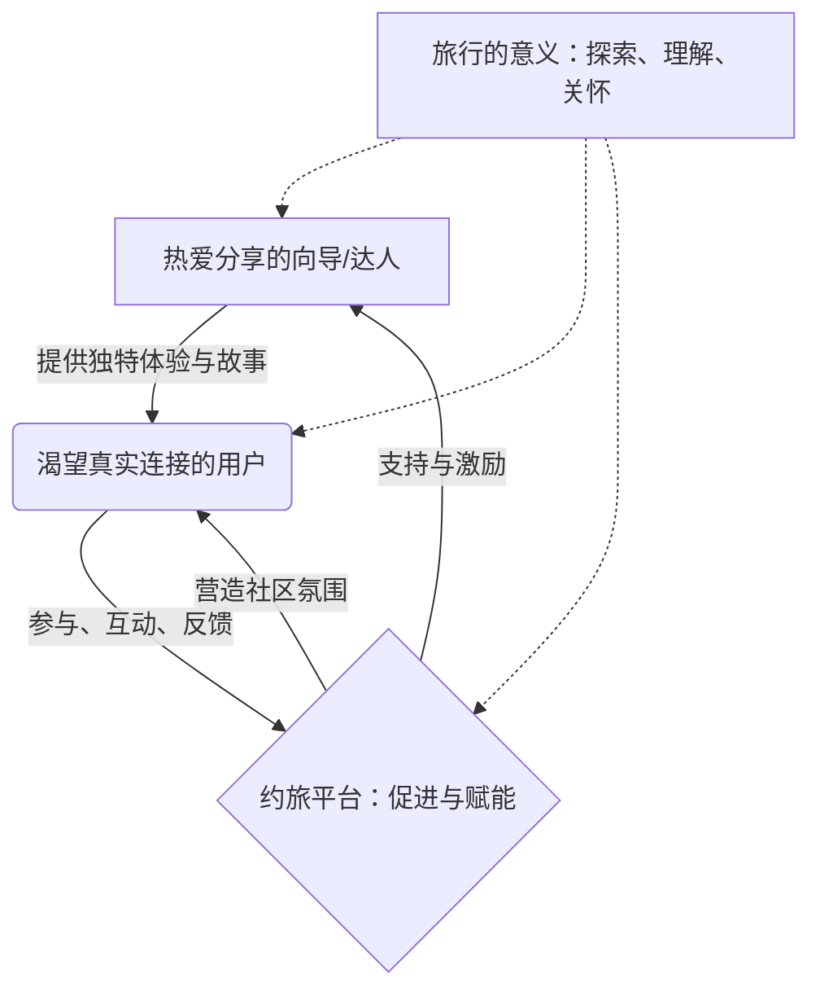
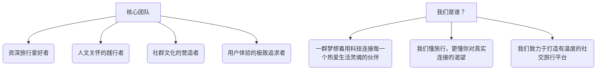

# 约旅平台展会演讲PPT

## 文档信息
- **演讲主题**: 约旅平台 - 重新定义网红旅游体验
- **演讲时长**: 18分钟
- **目标受众**: 展会观众、投资人、代理商、合作伙伴
- **版本**: v1.0.0
- **创建日期**: 2024年

---

## 第1张：开场标题页

### 幻灯片内容
**主标题**: 约旅平台
**副标题**: 连接你我，重拾旅行的温度
**Slogan**: 社交旅行 × 人文关怀 × 真实体验 = 生活新篇章

### 视觉设计
- **背景**: 香港维港夜景全景图
- **前景**: 半透明科技感覆盖层
- **Logo**: 约旅平台品牌标识
- **底部**: 演讲者信息和日期

### 演讲脚本（2分钟）
"各位尊敬的来宾，大家好！

在这个快节奏的时代，科技日新月异，我们的生活似乎越来越便捷，但人与人之间的距离，似乎也越来越远。我们有多久没有和朋友一起放声歌唱，有多久没有一起探索未知的风景，有多久没有真正地去体验生活，而不是被工作和赚钱所裹挟？

我们是否也曾怀念，小时候那种邻里串门、朋友相聚的纯粹快乐？我们是否也曾渴望，摆脱“金钱的奴隶”这种标签，去追求真正热爱的事情，去感受生活本来的面貌？

今天，我们带来的“约旅平台”，正是希望回应这份内心的呼唤。我们相信，旅行不应只是走马观花，更是一场心灵的约会，一次人与人、人与自然的深度连接。我们希望通过约旅，让喜欢玩的人带着对生活充满好奇的人一起去探索，去分享，去创造属于自己的美好回忆。

我是[姓名]，约旅平台的[职位]。今天，我将用18分钟的时间，与大家分享我们如何通过“约旅平台”，倡导一种全新的社交旅行方式，回归旅行的本质，重拾生活的温度。

---

## 第2张：问题洞察

### 幻灯片内容
**标题**: 时代的呼唤：我们为何渴望真实的连接与体验？

**内容布局**:
```
现代生活的困境                我们内心的渴望
├─ 科技带来的疏离感           ├─ 真实的人际互动
├─ 生活节奏过快，压力巨大     ├─ 放慢脚步，体验生活
├─ 目标迷失，意义感缺失       ├─ 寻找热爱，分享快乐
└─ 标准化生活，个性被压抑     └─ 追求独特，活出自我
```

**思考点**:
- 科技越发达，我们越需要人文关怀。
- 旅行是促进交流、体验生活、找回自我的重要途径。
- 我们不应成为“金钱的奴隶”，而应成为生活的主人。

### 演讲脚本（3分钟）
"我们生活在一个前所未有的时代。科技的飞速发展，AI的兴起，无疑为我们带来了巨大的便利。但与此同时，我们是否也感受到了一些隐忧？

**第一，科技带来的疏离感。** 我们习惯了在线交流，却可能忘记了面对面沟通的温暖。朋友圈点赞无数，却可能找不到一个可以深夜畅谈的朋友。

**第二，快节奏下的生活压力。** 我们每天忙于工作，追逐KPI，仿佛陷入了一个赚钱的循环，却渐渐忘记了奋斗的初衷是什么，忘记了去好好体验生活，感受世界的美好。

**第三，意义感的缺失与个性的压抑。** 我们常常被社会定义，被期望所束缚，追求着标准化的成功，却可能忽视了内心真正的热爱和渴望。人生只有一次，我们真的要这样被定义吗？

这些困境，让我们更加渴望真实的人际互动，渴望放慢脚步去体验生活，渴望找到自己热爱的事情并与人分享，渴望活出独特的自我。而旅行，正是承载这些渴望的最佳方式之一。它让我们走出日常，遇见不同的人，看不一样的风景，体验多元的文化，最终，更好地认识自己，关怀他人。"

---

## 第3张：我们的答案：约旅平台 - 用心连接每一次旅行

### 幻灯片内容
**标题**: 约旅平台 - 用心连接每一次旅行

**核心价值主张**:
```
💖 回归社交本质
   • 鼓励真实分享，构建有温度的旅行社区
   • 促进成员互动，结识志同道合的旅伴
   
🌿 倡导人文关怀
   • 尊重个体差异，提供包容性的旅行选择
   • 关注情感需求，让旅行充满温暖与关爱
   
✨ 追求真实体验
   • 摆脱滤镜，发现旅途中的本真之美
   • 深入当地，体验原汁原味的风土人情
```
**平台理念**: 让喜欢玩的人，带着对世界好奇的人一起玩，实现共同的热爱与自由。

### 演讲脚本（2分钟）
"面对时代的呼唤和我们内心的渴望，‘约旅平台’希望提供一个不同的答案。

我们致力于**回归社交本质**。我们相信，旅行的意义不仅在于看风景，更在于与谁同行，分享怎样的心情。约旅平台鼓励用户真实地分享自己的旅行故事和感悟，构建一个充满善意和温度的旅行社区。在这里，你可以轻松找到与你兴趣相投的旅伴，一起探索未知，分享喜悦。

我们**倡导人文关怀**。我们深知每个人都是独特的，对旅行的期待也各不相同。约旅平台尊重并包容这些差异，提供多元化的旅行主题和方式，更关注旅行中的情感需求，努力让每一次出行都充满温暖与关爱，让每个人都能在旅途中找到归属感。

我们**追求真实体验**。我们希望帮助大家摆脱过度美化的滤镜，去发现旅途中那些不加修饰的本真之美。通过约旅平台，你可以更深入地了解当地文化，体验原汁原味的风土人情，让每一次旅行都成为一次深刻的生命体验。

我们的核心理念很简单：**让喜欢玩、会玩的人，带着那些对世界充满好奇、渴望体验生活的人一起去玩。** 这不仅仅是为了完成一次旅行，更是为了让每个人都能在自己热爱的事情中找到乐趣，实现心灵的自由，而不是被工作或固有的生活模式所束缚。我们希望讲述的，是关于回归、关于探索、关于连接的故事。"

---

## 第4张：约旅如何促进连接与关怀

### 幻灯片内容
**标题**: 约旅如何促进连接与关怀

**核心体验设计**:
```
1. 🤝 遇见懂你的人 (个性化匹配)
   • 基于共同兴趣与价值观的连接
   • 发现志同道合的旅伴与向导
   • 告别孤独，与“对的人”同行

2. 🌍 身临其境的预体验 (灵感激发)
   • 通过分享与故事，感受目的地的魅力
   • 激发探索欲，点燃旅行的火花
   • 在出发前，就已心向往之

3. 💬 分享与共鸣的社区 (情感连接)
   • 真实的旅行故事与经验分享
   • 建立有温度的互动与情感支持
   • 在这里，每个声音都被听见，每份感受都被理解

4. ❤️ 用心守护每一程 (安全与关怀)
   • 透明的行程规划与信息共享
   • 互助友爱的社区氛围
   • 必要的安全提醒与支持，让关怀无处不在
```

### 演讲脚本（3分钟）
"那么，约旅平台具体是如何促进人与人之间的连接，并体现人文关怀的呢？我们通过以下几个方面的精心设计来实现：

**首先，是“遇见懂你的人”。** 我们相信，旅行的质量很大程度上取决于与谁同行。约旅平台致力于帮助你找到那些与你有共同兴趣、相似价值观的旅伴或向导。我们希望每一次出发，都是与“对的人”一起，去探索，去分享，告别旅途中的孤独感。

**其次，我们提供“身临其境的预体验”。** 这并非指冷冰冰的技术展示，而是通过他人鲜活的旅行故事、真实的图片和视频分享，让你在出发前就能感受到目的地的魅力和温度，激发你的探索欲望，点燃你对旅行的火花。让你在未启程时，心已向往。

**再次，我们构建了“分享与共鸣的社区”。** 这是一个充满善意和理解的地方。在这里，你可以自由地分享你的旅行故事、途中的喜怒哀乐，也可以从他人的经验中获得启发和帮助。我们鼓励真实的表达，希望在这里，每个人的声音都能被听见，每一份独特感受都能得到共鸣和理解，建立起温暖的情感连接。

**最后，我们强调“用心守护每一程”。** 这不仅仅是安全保障，更是一种人文关怀的体现。我们倡导透明的行程规划和信息共享，营造互助友爱的社区氛围。同时，平台也会提供必要的安全提醒和支持，让这份关怀贯穿旅途的始终，让你感受到安心和温暖。"

---

## 第5张：约旅平台：为社交与关怀而设计

### 幻灯片内容
**标题**: 约旅平台：为社交与关怀而设计

**核心体验模块 (用户视角)**:
```
探索与发现
├─ 浏览真实的旅行故事与分享
├─ 发现志同道合的旅伴与向导
└─ 个性化主题旅行推荐 (如文化探索、自然徒步、美食之旅等)

连接与互动
├─ 便捷的沟通工具，与向导/旅伴深入交流
├─ 参与社区话题讨论，分享见解与感悟
└─ 组织或加入小团体旅行，共享旅途乐趣

规划与启程
├─ 透明的行程信息与合理的费用结构
├─ 灵活的定制化服务，满足个性需求
└─ 清晰的安全指引与互助提醒

分享与回馈
├─ 记录并分享你的旅行点滴与感悟
├─ 评价与感谢为你提供帮助的向导和旅伴
└─ 成为分享者，将你的热爱传递给更多人
```

**赋能分享者 (向导/旅行达人)**:
```
展现你的热爱
├─ 创建个性化的主页，分享你的旅行理念与专长
├─ 发布你精心策划的旅行路线与体验活动
└─ 与认同你的人建立连接，共同探索

轻松管理与互动
├─ 便捷的行程管理与沟通工具
├─ 获取真实的反馈，持续优化体验
└─ 成为社群的积极贡献者，传递正能量
```

### 演讲脚本（2分钟）
"为了实现我们所倡导的社交旅行与人文关怀，约旅平台在功能设计上处处体现着用心。

**从用户的视角来看：**

在“探索与发现”阶段，你看到的不再是冰冷的商品列表，而是由真实用户和热情向导分享的旅行故事与体验。你可以根据共同的兴趣爱好，发现那些真正懂你的旅伴和向导，平台也会为你推荐符合你价值观的个性化主题旅行，无论是深度文化探索，还是轻松的自然徒步。

在“连接与互动”环节，我们提供了便捷的沟通工具，让你能与向导或潜在旅伴进行深入的交流。你可以积极参与社区里的话题讨论，分享你的见解，也可以轻松组织或加入一个小团体，共同规划并享受旅途的乐趣。

当进入“规划与启程”阶段，你会看到透明的行程信息和合理的费用构成。我们鼓励灵活的定制化服务来满足你的个性需求，并提供清晰的安全指引和社群内的互助提醒，让你安心出行。

旅行结束后，在“分享与回馈”模块，你可以方便地记录并分享旅途中的点点滴滴和感悟，向为你提供帮助的向导和旅伴表达感谢。更重要的是，你也可以从一个体验者转变为分享者，将你的热爱和发现传递给更多人。

**对于那些乐于分享、热爱带领他人探索的向导或旅行达人们：**

约旅平台也为你们提供了充分展现自我的空间。你可以创建个性化的主页，分享你的旅行理念和独特专长，发布你精心策划的旅行路线和体验活动，与那些真正认同你、被你吸引的人建立连接，共同去探索这个精彩的世界。

同时，我们也提供了便捷的行程管理和互动工具，帮助你更好地组织活动，获取真实的反馈，并鼓励你成为社群的积极贡献者，传递旅行中的正能量。我们相信，最好的引导是源于热爱，而非单纯的商业驱动。"

---

## 第6张：我们的价值：连接、分享与成长

### 幻灯片内容
**标题**: 我们的价值：连接、分享与成长

**核心价值循环**:


**我们如何创造价值**:
- **为人与人的连接创造土壤**: 打破隔阂，让相似的灵魂在旅途中相遇。
- **为深度的文化交流搭建桥梁**: 不止于观光，更在于体验、理解和尊重。
- **为个人成长提供契机**: 旅行是最好的学习，每一次出发都是一次自我发现。
- **为热爱与分享提供平台**: 让那些对生活充满热情的人，能将这份能量传递给更多人。

### 演讲脚本（2分钟）
"谈到商业模式，我们更愿意称之为‘价值创造模式’。约旅平台的核心并非冰冷的交易，而是围绕‘人’本身，去构建一个可持续的、充满人文关怀的生态。

大家可以看到这个循环：
热爱分享的向导和旅行达人们，他们是故事的创造者和独特体验的提供者。他们将自己的热爱、知识和对生活的美好向往，通过约旅平台传递给那些渴望真实连接、期待深度体验的用户。

用户在平台上参与互动，提供真实的反馈，他们的需求和期待又会进一步激励向导们创造更优质的内容和体验。而约旅平台在其中扮演的角色，是促进者和赋能者。我们努力营造一个安全、友好、充满信任的社区氛围，为双方提供必要的支持和激励。

这一切都源于我们对‘旅行的意义’的理解：旅行不仅仅是从一个地方到另一个地方，它关乎探索未知，理解多元文化，更重要的是，在旅途中感受人与人之间的关怀与连接。这才是我们平台价值的核心所在。

我们相信，当平台能够真正为人与人的连接创造土壤，为深度的文化交流搭建桥梁，为个体的成长提供契机，并让那些对生活充满热情的人能够自由地分享时，商业上的成功会自然而来。我们追求的，是能带来长远社会价值的健康成长，而非短期的利益最大化。"

---

## 第7张：时代的需求：回归真实社交与深度体验

### 幻灯片内容
**标题**: 时代的需求：回归真实社交与深度体验

**当代人的渴望**:
- **厌倦了快节奏与表面化**: 在信息爆炸的时代，人们渴望从虚拟回归现实，寻求更真切的情感连接。
- **追求个性化与意义感**: 标准化的产品已无法满足需求，人们希望旅行能带来独特的个人体验和生命感悟。
- **对“附近”的重新发现**: 不必远方，身边的美好同样值得探索，与志同道合的人一起，发现日常中的诗意。
- **对人文关怀的向往**: 在日益原子化的社会，人们期待在社群中找到归属感、温暖和互助。

**约旅的回应**:
- **倡导“慢旅行”**: 放慢脚步，用心感受，与当地人深入交流，体验真实的生活。
- **聚焦“人的故事”**: 每一段旅程，每一个向导，背后都有独特的故事，等待被聆听和分享。
- **构建“有温度的社区”**: 在这里，分享不仅仅是信息，更是情感的流动和善意的传递。
- **赋能“热爱生活的人”**: 让那些对世界充满好奇、乐于分享的人，成为连接的纽带。

### 演讲脚本（2分钟）
"我们认为，约旅平台的出现，恰恰回应了这个时代深处的一种呼唤，一种对回归真实社交和深度体验的渴望。

在今天这个科技高度发达、信息爆炸的时代，许多人感到疲惫。我们被无尽的屏幕和快节奏的生活所裹挟，反而越来越渴望从虚拟世界中抽离，去寻找那些更真切、更实在的情感连接和生活体验。小时候那种邻里串门、朋友围坐一起唱歌游戏的简单快乐，似乎越来越遥远。

标准化的旅行产品，走马观花的行程，已经无法满足现代人对个性化和意义感的追求。人们不再仅仅满足于“到此一游”，而是希望旅行能带来独特的个人体验，能触动心灵，能引发对生活、对世界的思考和感悟。

我们还观察到一种趋势，那就是对“附近”的重新发现。诗和远方固然美好，但我们身边的城市、乡村，同样也隐藏着许多不为人知的美好和值得探索的故事。关键在于，和谁一起去发现，如何去体验。

更重要的是，在日益原子化的社会结构中，人们内心深处对人文关怀、对社群归属感的向往从未停止。我们期待在旅途中，在社群中，能找到温暖、理解和互助的力量。

约旅平台正是基于这样的洞察而生。我们倡导“慢旅行”，鼓励大家放慢脚步，用心去感受每一个地方的独特气息，与当地人进行深入的交流，体验他们真实的生活方式。我们聚焦“人的故事”，因为我们相信，每一段旅程，每一个向导，背后都有着独特而动人的故事，这些故事值得被聆听和分享。我们致力于构建一个“有温度的社区”，在这里，分享不仅仅是信息的传递，更是情感的流动和善意的传递。我们希望赋能那些真正热爱生活、对世界充满好奇、乐于分享的人们，让他们成为连接人与人、传递美好的纽带。"

---

## 第8张：诚邀您成为我们的“人文旅行合伙人”

### 幻灯片内容
**标题**: 诚邀您成为我们的“人文旅行合伙人”

**我们寻找这样的您**:
- **认同约旅的理念**: 您深刻理解并认同我们关于社交旅行和人文关怀的价值主张。
- **热爱分享与连接**: 您乐于分享旅行的美好，并善于将人们连接在一起。
- **在当地拥有影响力或资源**: 您在特定区域或社群中，能够帮助我们传播理念，组织有意义的活动。
- **期待共同成长**: 您希望与一个有情怀、有愿景的平台共同成长，而不仅仅是追求短期商业利益。

**我们能为您提供**:
- **品牌与理念的共享**: 成为约旅品牌故事的一部分，共同推广一种更美好的旅行方式。
- **平台资源与工具支持**: 利用约旅平台的技术与社群资源，更轻松地组织和推广您的活动。
- **社群共建与价值共享**: 参与到约旅大家庭的建设中，共享平台发展带来的成果与喜悦。
- **一个有温度的合作网络**: 与来自各地的、志同道合的伙伴们交流学习，共同进步。

**合作方式（示例）**:
- **城市文化沙龙发起人**: 在您的城市定期组织关于旅行、文化、生活美学的分享会。
- **特色主题路线共创者**: 与平台共同设计并推广具有深度人文体验的旅行路线。
- **地方社群运营伙伴**: 协助维护和活跃特定区域的用户社群，传递平台价值。

### 演讲脚本（2分钟）
"我们深知，要将约旅平台所倡导的社交旅行和人文关怀理念传递给更多人，单靠我们自己是远远不够的。因此，我们在这里，诚挚地邀请在座的各位，以及所有认同我们理念的朋友们，成为我们的‘人文旅行合伙人’。

我们寻找的是怎样的伙伴呢？
首先，您一定深刻理解并认同我们关于社交旅行和人文关怀的价值主张。您相信旅行的力量，相信人与人之间真诚连接的美好。
其次，您本身就是一位热爱分享、乐于连接的人。您愿意将自己体验到的旅行美好分享出去，并有热情将志同道合的人们聚集在一起。
如果您在当地拥有一定的影响力或独特的资源，比如熟悉当地文化、拥有特色场地，或者能够组织起一个社群，那将非常有价值。
最重要的是，您期待与一个有情怀、有愿景的平台共同成长，而不仅仅是追求短期的商业回报。

那么，成为约旅的‘人文旅行合伙人’，您能获得什么呢？
您将成为约旅品牌故事的一部分，与我们一起，向世界推广一种更有人情味、更有深度的旅行方式。
我们将为您提供平台的技术和社群资源支持，让您能更轻松地组织和推广您所热爱的活动和体验。
您将深度参与到约旅这个大家庭的建设中来，与我们共同见证和分享平台发展所带来的成果与喜悦。
更重要的是，您将加入一个充满温度的合作网络，与来自全国乃至世界各地、志同道合的伙伴们交流学习，共同进步，不再孤单。

具体的合作方式可以非常灵活和多元。比如，您可以成为我们某个城市的文化沙龙发起人，定期组织关于旅行、文化、生活美学的分享会；或者，您可以作为特色主题路线的共创者，与平台一起设计并推广那些真正能触动人心的深度人文体验路线；再或者，您可以成为我们某个地方社群的运营伙伴，协助我们维护和活跃用户社群，将约旅的温暖传递给更多人。

我们相信，这不仅仅是一份商业合作，更是一份基于共同价值观的美好事业。我们期待与您携手，一起让旅行回归其本真，让更多人在旅途中找到连接、找到关怀、找到生活的更多可能性。"

---

## 第9张：我们的团队：一群热爱生活与分享的探索者

### 幻灯片内容
**标题**: 因爱集结，为梦前行

**核心理念**: 我们相信，旅行的真谛在于分享与连接，技术应服务于人性的温暖。

**团队特质**:


**团队故事片段 (可配图或短视频)**:
- 成员A在一次独自旅行中，通过当地人的帮助解决了困境，感受到了陌生人的善意，萌生了创建平台的想法。
- 成员B组织过多次成功的线下主题旅行活动，深谙如何激发群体的互动与共鸣。
- 团队成员们一起探索未知目的地，共同克服挑战，分享旅途中的欢笑与感动。

### 演讲脚本（1分钟）
"支撑‘约旅’前行的，是我们这群对生活充满热忱、对世界怀揣好奇、对人与人的连接抱有坚定信念的伙伴。

我们不仅仅是开发者、设计师、运营者，我们首先是旅行的热爱者，是人文关怀的践行者，是社群文化的营造者。我们中的许多人，都有过被旅行中的善意所触动、被人与人的真诚交流所温暖的经历。这些经历，让我们深刻理解现代人对真实社交的渴望，对深度体验的向往。

我们聚在一起，不是为了打造一个冰冷的技术工具，而是希望构建一个充满人情味的社区。我们希望通过‘约旅’，让更多人找到志同道合的旅伴，分享旅途中的喜怒哀乐，共同探索这个精彩的世界，重拾那些在快节奏生活中被忽略的美好与感动。我们相信，科技的力量，最终是为了服务于人性的温暖与连接。"

---

## 第10张：我们的愿景：共创人文社交旅行新篇章

### 幻灯片内容
**标题**: 与时光同行，与美好相约

**发展蓝图**: (用更感性的语言和意象图替代具体指标)
```
🌱 萌芽与耕耘 (近期)
   ├─ 点亮社群星火：汇聚首批热爱分享的探索者
   ├─ 打磨有温度的体验：持续优化每一次相遇与互动
   └─ 播撒人文种子：鼓励真实故事的分享与传播

🌳 成长与繁茂 (中期)
   ├─ 构建多元文化交织的旅行者家园
   ├─ 深化主题旅行，探索生活的一万种可能
   └─ 赋能个体，让每个人都能成为故事的分享者与创造者

🌍 连接与远方 (远期)
   ├─ 成为全球人文旅行者的精神灯塔
   ├─ 推动跨越地域与文化的深度理解与友谊
   └─ 让每一次出发，都成为一次心灵的回归与滋养
```

**我们关注**: (替代“关键指标”)
- 😊 用户的微笑与满足
- 🤝 社群的活跃与温暖
- 💖 平台人文价值的深度与广度
- 🌟 每一个被点亮的美好瞬间

### 演讲脚本（1分钟）
"对于未来，我们没有冰冷的数字KPI，我们描绘的是一幅充满人文色彩的画卷。

近期，我们将专注于点亮社群的星星之火，汇聚那些真正热爱分享、渴望连接的先行者。我们会用心打磨每一次相遇和互动，让平台充满温度，并鼓励每一个真实、动人的旅行故事在这里生根发芽。

中期，我们希望‘约旅’能成长为一个多元文化交织的旅行者家园。我们将深化各种主题旅行，与大家一同探索生活的无限可能，并赋能每一位用户，让每个人都能成为故事的分享者和创造者。

长远来看，我们梦想‘约旅’能成为全球人文旅行者的精神灯塔，推动跨越地域与文化的深度理解与友谊。我们希望，每一次通过‘约旅’的出发，都能成为一次心灵的回归与滋养。

我们关注的，不是冰冷的数字，而是用户的微笑，社群的温暖，平台人文价值的深度，以及那些因‘约旅’而被点亮的美好瞬间。"

---

## 第11张：与我们同行：投资于人性的温暖与连接

### 幻灯片内容
**标题**: 一份有温度的邀约，共筑人文旅行的未来

**我们相信的价值**: (替代“投资亮点”)
```
💖 人文关怀的力量
   • 在快节奏时代，回归人与人之间真实的连接
   • 用科技传递善意，构建有温度的社群
   • 每一次成功的连接，都是对人文精神的颂扬

✨ 独特社群的魅力
   • 汇聚热爱生活、乐于分享的优质用户
   • 强调深度体验，而非走马观花
   • 共同创造与守护积极、友善的社区文化

🌿 可持续的生命力
   • 满足人类对社交与探索的本能需求
   • 创造超越商业利益的社会价值与情感认同
   • 与用户共同成长，构建有长久活力的生态
```

**携手同行**: (替代“资金需求”)
- 我们寻找的不仅是资金，更是认同我们理念的同行者。
- 共同投入：资源、智慧、热情，一起浇灌这片人文旅行的土壤。
- 共享成果：不仅是商业上的回报，更是推动社会向善、连接人心的成就感。

### 演讲脚本（2分钟）
"我们深知，在这个时代谈论情怀与人文，似乎有些不合时宜。但我们坚信，科技越是发达，我们越需要回归人与人之间真实的温暖与连接。这正是‘约旅’的核心价值所在。

我们邀您投资的，不仅仅是一个商业项目，更是一份对人文关怀的信仰，一个独特社群的未来，一种可持续的生活方式。

我们相信人文关怀的力量。在这个快节奏的时代，‘约旅’致力于用科技传递善意，构建一个有温度的社群，让每一次成功的连接都成为对人文精神的颂扬。

我们珍视独特社群的魅力。‘约旅’将汇聚那些真正热爱生活、乐于分享的优质用户。我们强调深度的体验，而非走马观花式的打卡；我们鼓励共同创造与守护一个积极、友善的社区文化。

我们追求可持续的生命力。‘约旅’满足的是人类对社交与探索的本能需求，它所创造的社会价值与情感认同，将超越单纯的商业利益，与用户共同成长，构建一个具有长久活力的生态。

因此，我们寻找的不仅仅是资金，更是认同我们理念、愿意与我们一同浇灌这片人文旅行土壤的同行者。我们期待与您共同投入资源、智慧与热情，未来共享的，也绝不仅仅是商业上的回报，更是那份推动社会向善、连接人心的深深成就感。"

---

## 第12张：我们的初心：重拾温暖连接，丰富生命体验

### 幻灯片内容
**标题**: 旅行的意义，不止于风景

**社会价值与人文关怀**:
```
💖 重燃人际间的温暖
   • 打破都市隔阂，创造真实的相遇与陪伴
   • 鼓励分享与互助，构建友善互信的旅行氛围
   • 让每一次同行，都成为一段温暖的回忆

🌍 深化文化理解与共情
   • 走近当地生活，体验多元文化的魅力
   • 促进不同背景人们的对话与交流
   • 用脚步丈量世界，用心灵感受差异与共通

🧘 滋养个体生命成长
   • 在旅途中发现自我，拓展认知边界
   • 鼓励勇敢尝试，体验生活的不同面向
   • 让旅行成为一种生活态度，一种持续学习与探索的过程

😊 传递快乐与正能量
   • 分享旅途中的喜悦，点亮他人的生活
   • 倡导积极乐观的生活方式
   • 用美好的体验，对抗生活的疲惫与焦虑
```

### 演讲脚本（1分钟）
"‘约旅’的诞生，源于我们对这个时代深深的思考。科技带来了便利，但也让我们在不经意间，与真实的连接渐行渐远。我们相信，旅行的意义，绝不仅仅是看风景，更是关乎人与人的温暖相遇，文化的深度理解，以及个体生命的滋养与成长。

我们希望‘约旅’能重燃人际间的温暖。打破都市生活的隔阂，为大家创造真实相遇与真诚陪伴的机会，鼓励分享与互助，让每一段同行都成为温暖的回忆。

我们致力于深化文化的理解与共情。通过‘约旅’，我们希望大家能更深入地走近当地生活，体验多元文化的独特魅力，促进不同背景人们之间的对话与交流，用心灵去感受世界的差异与共通。

我们关注每一个个体的生命成长。希望在旅途中，每个人都能有所发现，拓展认知的边界，勇敢尝试生活的不同面向，让旅行成为一种积极的生活态度，一个持续学习与探索的过程。

最终，我们希望‘约旅’能传递快乐与正能量，让大家分享旅途中的喜悦，点亮彼此的生活，用美好的体验对抗日常的疲惫与焦虑。"

---

## 第13张：加入我们，共绘人文旅行的美好画卷

### 幻灯片内容
**标题**: 寻找同行者，共创有温度的旅行故事

**我们期待这样的您**: (替代“合作邀请”)
```
🌟 热爱生活，乐于分享的您
   • 无论是资深驴友，还是生活美学达人
   • 愿意分享您的旅行故事与生活感悟

💖 认同人文价值，渴望真实连接的您
   • 相信人与人之间的善意与温暖
   • 期待在旅途中遇见有趣的灵魂

🤝 愿意共同构建友善社群的您
   • 尊重多元，包容差异
   • 乐于为社群贡献积极能量

💡 拥有独特视角或资源的您
   • 能为平台带来独特的旅行线路、文化体验或创意内容
   • 或是能帮助我们将这份理念传递给更多人
```

**联系我们，开启一段有意义的旅程**:
   ├─ 官方网站：[保留或更新]
   ├─ 微信公众号/社群：[建议设立并突出]
   ├─ 邮箱：hello@tripwithcelebs.com (更亲和)
   └─ 现场交流：期待与您面对面，聊聊我们共同的旅行梦想

### 演讲脚本（1分钟）
"我们深知，这份关于人文旅行的梦想，需要更多志同道合的伙伴一同来描绘。

我们期待热爱生活、乐于分享的您。无论您是经验丰富的旅行家，还是对生活有独到见解的美学达人，只要您愿意分享您的故事与感悟，‘约旅’就是您的舞台。

我们期待认同人文价值、渴望真实连接的您。如果您和我们一样，相信人与人之间的善意与温暖，期待在旅途中遇见更多有趣的灵魂，那么我们便是同路人。

我们期待愿意共同构建友善社群的您。我们希望‘约旅’是一个充满尊重、包容与积极能量的地方，这需要每一位成员的共同守护。

我们也欢迎拥有独特视角或资源的您。如果您能为平台带来独特的旅行线路、深度的文化体验，或是创新的内容形式，甚至只是帮助我们将这份理念传递给更多人，我们都无比期待您的加入。

您可以通过屏幕上的方式联系我们，更期待在今天活动结束后，能与您面对面，聊聊我们心中那份共同的、关于旅行与生活的美好向往。让我们一起，开启一段更有意义的旅程！"

---

## 第14张：感谢聆听，期待与您在旅途中相遇

### 幻灯片内容
**主标题**: 谢谢！
**副标题**: 约旅 - 时光很慢，风景很美，我们一起出发

### 视觉设计
- **背景**: 一张充满故事感的旅行合影，人们笑容灿烂，背景是美丽的自然或人文景观。
- **前景**: 约旅平台的Logo，以及新的Slogan。
- **底部**: 微信公众号/社群二维码，以及一句温暖的邀请语，例如：“扫码加入我们，开启下一段美好旅程。”

### 演讲脚本（30秒）
"感谢各位的聆听！

约旅平台的使命是让每一次旅行都成为美好回忆。我们相信，通过技术创新和模式创新，我们能够重新定义旅游体验，为用户创造更大价值。

期待与各位的进一步交流合作！谢谢大家！"

---

## 演讲技巧与注意事项

### 演讲节奏控制
- **开场3分钟**: 抓住注意力，建立信任
- **核心内容12分钟**: 逻辑清晰，重点突出
- **结尾3分钟**: 强化记忆，引导行动

### 互动设计
1. **开场提问**: "有多少人遇到过旅游被坑的经历？"
2. **中场互动**: 邀请观众体验VR导览功能
3. **结尾交流**: 现场答疑和深度交流

### 关键信息强化
- **核心价值**: 重新定义网红旅游体验（重复3次）
- **技术优势**: 五大核心技术创新
- **商业价值**: 千亿市场机会
- **合作共赢**: 代理合作模式

### 备用问答

**Q: 如何保证网红/导游的服务质量？**
A: 我们有完整的认证体系、评价机制和行程轨迹验证系统，确保服务质量。

**Q: 与传统OTA平台有什么区别？**
A: 我们专注于网红旅游垂直领域，提供更个性化、互动性更强的服务体验。

**Q: 技术壁垒在哪里？**
A: 我们的五大核心技术，特别是VR导览和轨迹双验证系统，已申请多项专利。

**Q: 盈利模式是否可持续？**
A: 我们有多元化收入来源，随着用户规模增长，网络效应会带来更高的盈利能力。

---

## 制作说明

### 技术要求
- **软件**: PowerPoint 2019+ 或 Keynote
- **分辨率**: 1920×1080 (16:9)
- **字体**: 思源黑体（中文）+ Montserrat（英文）
- **文件大小**: 控制在50MB以内

### 视觉风格
- **主色调**: 科技蓝 (#2E86AB) + 旅游橙 (#F24236) + 简洁白 (#FFFFFF)
- **设计风格**: 现代简约、科技感、国际化
- **图片风格**: 高质量旅游场景图 + 科技元素

### 最终检查清单
- [ ] 所有文字无错别字
- [ ] 图片清晰度符合要求
- [ ] 动画效果流畅
- [ ] 演讲时间控制在18分钟内
- [ ] 备用设备兼容性测试
- [ ] 演讲稿熟练程度

---

**文档结束**

*本PPT文档为约旅平台展会演讲专用，请根据实际情况调整内容和演讲时长。*