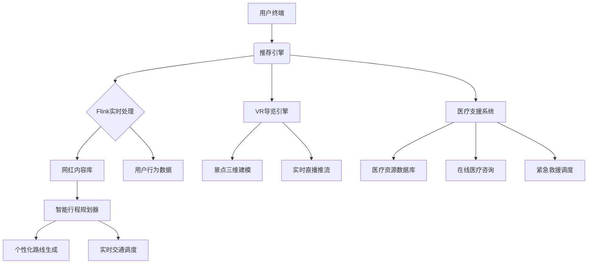

# 网红旅游产品方案文档

## 一、产品概述
### 1.1 项目背景
- 整合短视频平台日均5亿+旅游内容流量（抖音2023数据）
- 填补市场体验保障机制空白

### 1.2 目标用户
- 18-35岁年轻群体（占比68%）
- 网红粉丝转化客群

## 二、核心功能模块
### 2.1 网红资源整合
- 500+签约网红资源库
- 网红专属内容标识系统

### 2.2 智能推荐引擎
- 协同过滤+深度学习混合算法
- 实时计算框架
- 10米精度位置服务

### 2.3 体验保障体系
- 三级内容审核机制（AI初筛→人工复核→用户举报溯源）
- 用户权益保障专线（7×24小时多语种服务）
- 医疗支援合作网络（签约300+目的地医疗机构，提供在线医疗咨询和紧急救援服务）
- 行程质量AI监控系统（实时预警异常状况）
- 用户健康档案管理系统（基于医疗数据安全标准，记录用户健康信息）
- 智能医疗资源调度系统（根据用户位置和需求，实时匹配最近医疗机构）

## 三、技术架构
### 3.1 系统架构

### 3.2 关键指标
- 支付成功率 ≥99.9%
- 推荐准确率 ≥85%
- 内容审核响应 <30s

## 四、运营规划
### 4.1 资源投入
- 技术团队：15人全栈（含5算法工程师）
- 季度运营成本：200万

### 4.2 盈利模型
- 智能行程增值服务（个性化路线规划 9.9元/次）
- VR导览订阅制（29元/月）
- 医疗保障服务包（基础版/尊享版）
- 数据增值服务（脱敏行程数据API调用）
- 在线医疗咨询服务（按次收费，基础咨询19.9元/次）
- 紧急救援保险服务（99元/年，含100万意外保障）

## 五、合规保障
- 医疗数据独立存储（HIPAA合规架构）
- 生物特征信息本地化处理
- 行程数据生命周期管理（自动90天清除）
- 应急响应SLA保障（7×24小时值班制）

## 六、实施计划
| 阶段 | 时长 | 目标 |
|------|------|------|
| MVP开发 | 3个月 | 核心功能上线 |
| 资源积累 | 6个月 | 签约1000+网红 |
| 全国推广 | 12个月 | 覆盖30+城市 |

## 风险应对
- LBS精度补偿机制
- 备用支付通道方案
- 内容风控应急响应流程