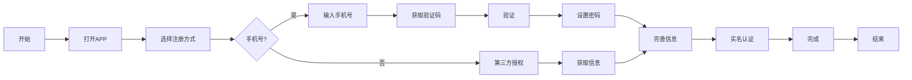
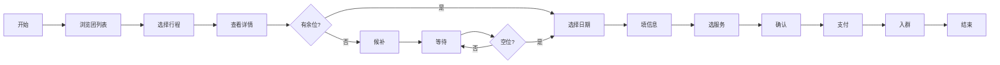
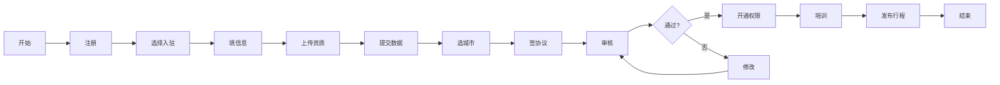
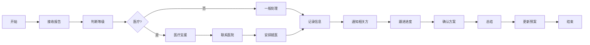
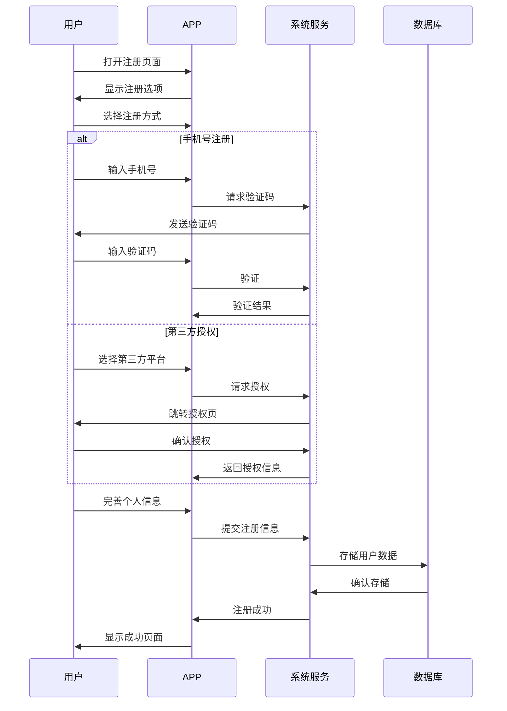
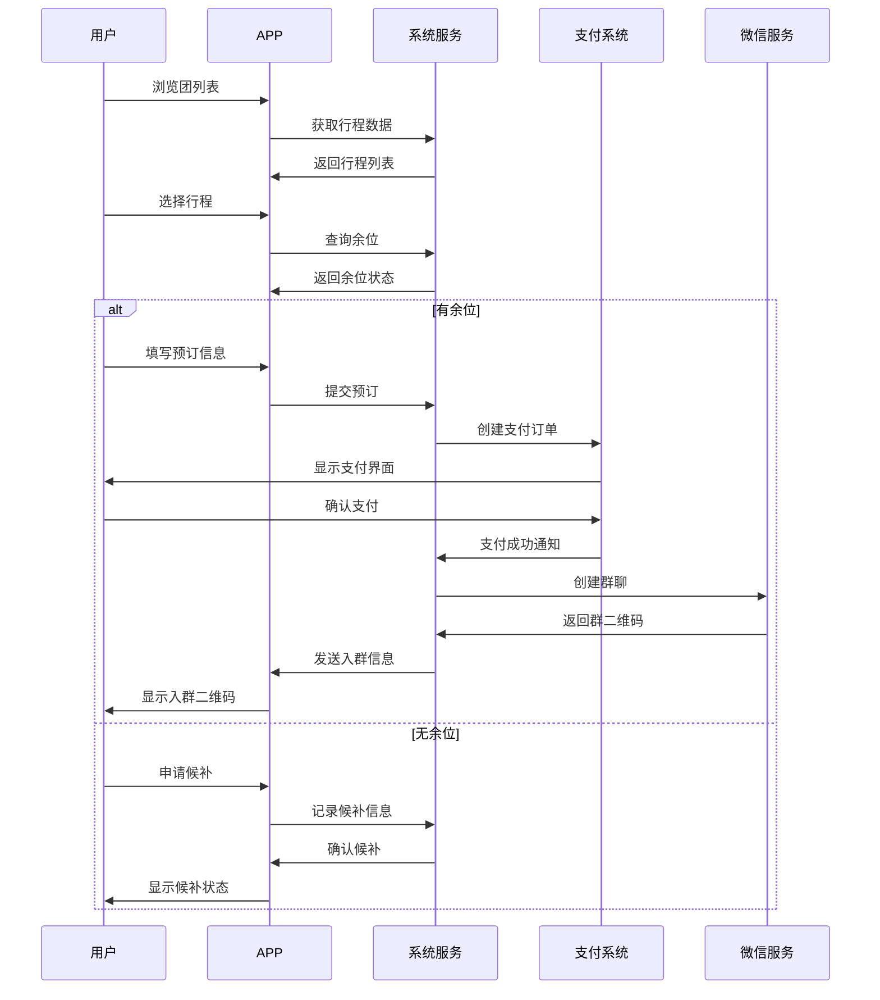
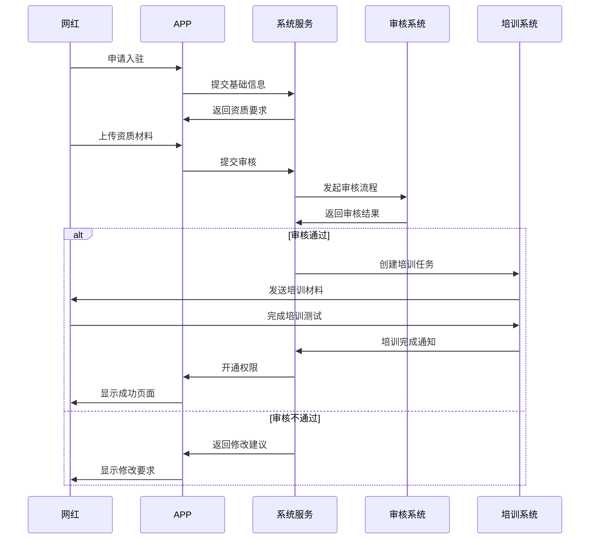
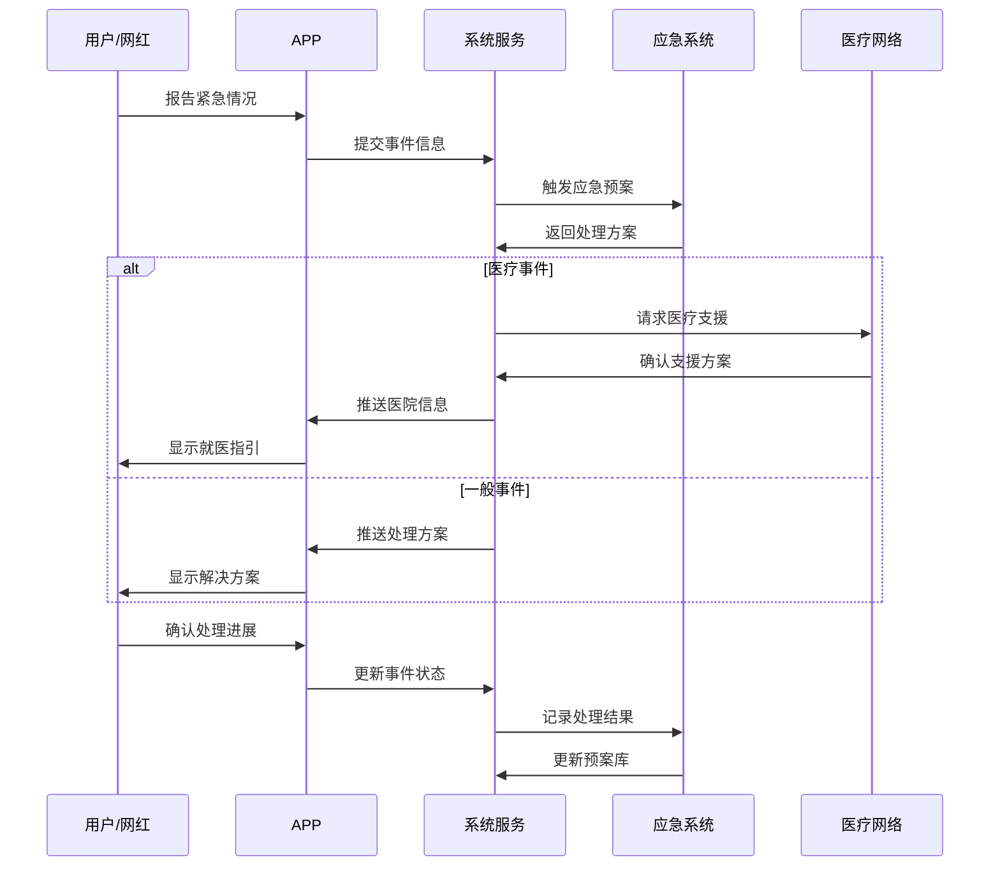

# 约旅产品方案（v2.1）

## 一、项目背景
结合全国文化旅游景点分布数据，针对当前旅游市场存在的网红经济与跟团游结合空白，打造新型旅游服务平台。整合短视频平台日均5亿+旅游内容流量（抖音2023数据），填补市场体验保障机制空白。

## 二、平台定位
1. **核心定位**：网红旅行团全流程管理平台
2. **目标用户**：
   - 18-35岁年轻群体（占比68%）
   - 网红粉丝转化客群
   - 用户群体我们希望对方可以进行真人认证和学历认证。为用户打造一个高净值的旅行交友平台。
3. **市场差异化**：
   - 以香港用户为基本盘，服务香港与大陆双向旅游需求
   - 提供粤语/英语/普通话多语言讲解服务
   - 网红与普通用户近距离互动体验
   - 优质内容输出，与电视台合作打造旅游节目
   - 导游+网红双入驻机制
   - 建立服务规范体系

## 三、核心功能设计
### 1. 网红管理模块
- 发车排期系统（支持阶梯定价）
- 粉丝报名管理系统
- 微信群自动化工具（消息同步/存档）
- 网红专属内容标识系统
- 500+签约网红资源库

### 2. 用户服务模块
- 动态推荐系统（基于城市/网红匹配）
- 直播联动机能（行程中内容共创）
- 法律协议模板库（肖像权/版权管理）
- VR导览服务（景点三维建模+实时直播）
- 跨境支付系统（支持多币种结算）
- 多语言客服系统（7×24小时在线）

### 3. 导游协作平台
- 知识共享中心
- 情绪价值培训体系
- 服务质量评分系统
- 医疗支援合作网络（300+目的地医疗机构）
- 智能医疗资源调度系统

### 4. 信任保障体系
- 三方电子协议管理系统（网红-游客-平台权责智能匹配）
- 行程轨迹双验证系统（GPS定位签到+直播流时间戳）
- 服务质量区块链存证（导游服务关键节点上链）
- 争议调解仲裁中心（7×24小时在线调解+法律支援直通）
- 信用评价双维度体系（服务能力星钻评级+用户情感指数）
- 三级内容审核机制（AI初筛→人工复核→用户举报溯源）
- 用户健康档案管理系统

## 四、运营策略
1. **饥饿营销机制**
   - 发车人数限额（20-50人/团）
   - 报名截止锁团
   - 候补转正流程

2. **双端推广计划**
   - 网红端：降低导游准入门槛
   - 用户端：行程直播内容激励

3. **私域运营方案**
   - 旅行团微信群生命周期管理
   - 二次开团唤醒机制
   - UGC内容沉淀平台

4. **盈利模型**
   - 智能行程增值服务（个性化路线规划 9.9元/次）
   - VR导览订阅制（29元/月）
   - 医疗保障服务包（基础版/尊享版）
   - 数据增值服务（脱敏行程数据API调用）
   - 在线医疗咨询服务（19.9元/次）
   - 紧急救援保险服务（99元/年，含100万意外保障）

## 五、技术架构
### 1. 系统指标
- 支付成功率 ≥99.9%
- 推荐准确率 ≥85%
- 内容审核响应 <30s
- LBS精度：10米以内

### 2. 合规保障
- 医疗数据独立存储（HIPAA合规架构）
- 生物特征信息本地化处理
- 行程数据生命周期管理（90天自动清除）
- 应急响应SLA保障（7×24小时值班制）

## 六、实施计划
| 阶段 | 时间 | 目标 |
|---|---|---|
| 港澳试点 | Q3 2025 | 签约100+港澳网红 |
| 规范建设 | Q4 2025 | 建立10项服务标准 |
| 资源积累 | Q1 2026 | 扩展至1000+网红 |
| 全国推广 | Q2-Q4 2026 | 覆盖30+重点城市 |

## 七、风险控制
1. 法律风险备案（用户行为规范）
2. 内容审核机制
3. 应急管理预案
4. LBS精度补偿机制
5. 备用支付通道方案
6. 内容风控应急响应流程

## 八、核心业务流程

### 1. 用户注册流程

### 2. 旅行团预订流程

### 3. 网红入驻流程

### 4. 紧急事件处理流程

## 九、系统时序图

### 1. 用户注册时序图

### 2. 旅行团预订时序图

### 3. 网红入驻时序图

### 4. 紧急事件处理时序图

附：详细功能原型见`产品原型`目录